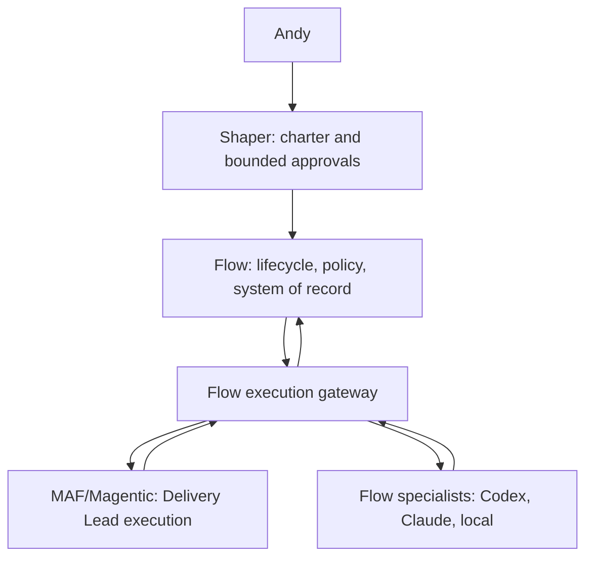

# Adopting Microsoft Agent Framework beneath Flow

Status: architecture direction accepted 2026-09-19. Updated 2026-09-25.

Progress against the adoption sequence below:

| Step | State | Where |
| --- | --- | --- |
| 1. Foundation and contract | Done | Flow-owned charter, envelope, action, grant, and receipt schemas (ADR 0011) |
| 2. Guarded local vertical slice | Done | Supervised local runner; the gateway is the only participant construction path |
| 3. Multi-turn and recovery | Done | Protocol v5 resume; chartered v8 recovery from the latest bound checkpoint, with operator reconcile (ADR 0012, 0013, 0016; v0.35.0) |
| 4. Provider adapters and usage | Done, no enforced cap | Codex, Claude, and Ollama adapters with observed usage. Call, runtime, and output bounds apply; there is no token or dollar cap. |
| 5. Shaper approval and operational handback | Not built, except diagnostics and reconcile | See below |

- **Shipped on the chartered path:**
  - Shaper Contract, Delivery Charter, and a fenced Delivery Lead claim sealed at `start-plan` (ADR 0014, v7).
  - A Flow-evaluated, evidence-bound verifier verdict with a Charter-sealed call cap (ADR 0015, v8).
  - As of v0.35.2, a local verifier satisfies that contract. Its system instructions are derived from the sealed role, and Ollama output is constrained by schema.
  - v8 attempts resume, and v8 attempts whose stored responses Flow already holds can be completed without a resend (`inspect-delivery`, `resolve-execution`, `recover-delivery-lead`).
- **Step 5 is not built yet:**
  - Delegated Shaper expansion. The contract requires `delegated_expansion: false`, and scope expansion halts for the Shaper, which in practice means Andy.
  - Cancellation, and recovery of a stuck run beyond the operator reconcile route.
  - Trace correlation across Flow, MAF, and provider sessions.
  - A handback through MCP. The MCP bridge only reads state and evidence and submits a proposed charter.
  - An enforced token cap.
- **Proof status:**
  - The only live end-to-end job ran on v7, before the final authority corrections.
  - No live v8 chartered job has run. The local verifier was checked live only on its own call, with a trivial diff.
  - Real-world validation is deliberately deferred until step 5 is in place.

The current chartered path is v8. Flow seals the Shaper Contract and Delivery Charter at `start-plan`, prepares an attempt, and runs stock Magentic in a supervised child. Flow authorizes each manager call and specialist action. It verifies the producer's scoped diff and runs the targeted test before a distinct Ollama verifier may run. Then it seals a receipt linked to that authority. Both v5 and v8 attempts can resume after interruption.

## Target boundary

Flow accepts a versioned charter and approved orchestration manifest, creates a run and execution attempt, and passes an immutable execution envelope to MAF. MAF plans, selects specialists, coordinates parallel work and handoffs, and checkpoints its execution. Every proposed delegation, replan, budget expansion, or consequential approval returns through a Flow gateway **before** a worker call. Flow records the decision and issues a scoped dispatch grant. A Flow-owned adapter turns that grant and the existing specialist definition into a Codex SDK/App Server, Claude Agent/Code, or local inference call. Worker results return to Flow as evidence and a receipt; MAF receives only the normalized result it needs to continue. Shaper can approve permitted expansion under the charter; anything outside delegated authority escalates to Andy.

The canonical boundary uses separate Flow-owned records. A reviewed, per-run `shaper_intent` JSON artifact supplies the structured problem, outcomes, controls, and exact specialist-definition digests; Flow does not guess these semantics from Markdown. A Shaper Contract seals that intent and its approved source digests. At `start-plan`, Flow creates an immutable Delivery Charter, a definition-to-delivery handoff, and generation 1 of the Delivery Lead claim under a per-run lock. The single `run.json` replacement is the authority commit point; staged artifacts before that point are inert, and append-only events are reconciled afterward. Provider sessions and MAF checkpoints are evidence linked to this chain, not authority.

Execution protocol v7 projects only the runtime fields Magentic needs and links them to the Shaper Contract, Delivery Charter, handoff, logical delivery attempt, and active owner generation. Magentic may choose among approved Claude and Codex producers, but Flow validates the selected assignment and a bounded comparative rationale before dispatch. A distinct Ollama verifier receives the Flow-observed diff and test evidence. Historical v6 records remain inspectable and cannot execute or resume through this path.

Execution protocol v8 keeps the v7 projection and adds a verifier contract that Flow owns (ADR 0015). Flow appends a versioned JSON output instruction to the verifier input, then records the provider response before judging it. A deterministic evaluator classifies the response as `valid_pass`, `valid_fail`, or `unusable`, bound by digest to the exact input, raw output, diff, and test evidence. Only a received response is judged; an uncertain send stays `unknown`. The Delivery Charter seals `max_verifier_calls`: one or two calls, two by default, which allows one retry after a non-pass. Flow denies an excess call before send. Completion requires the final evaluation to be `valid_pass`, and receipts recompute every evaluation. v7 receipts keep their original meaning.

MAF's checkpoint is execution state. Flow's run, manifest, charter version, policy decisions, receipt, artifact hashes, and reconciliation state remain authoritative. A checkpoint cannot authorize a new call merely because it contains a queued message. Flow can change the runtime behind the execution gateway without migrating the project record into MAF's models.

The first production launch should attach to an existing Flow CLI run. A separately supervised local MAF runner is the preferred packaging shape: Flow's current CLI remains usable without MAF installed, and a crashed worker process has an explicit recovery boundary. The runner exchanges versioned action and event records with Flow through a narrow local protocol; it cannot issue its own grants. An in-process optional MAF package is a simpler fallback for an initial constrained slice, but would couple the CLI process to MAF and provider failures. The supervised runner is the shipped launch surface (`flow run execute-chartered-job`); the in-process fallback was not built. MCP should later call the same Flow application gateway from ChatGPT or Claude, rather than create a second policy path.

## Integration contract

| Boundary | Flow-owned input or output | MAF's job |
| --- | --- | --- |
| Start | `run_id`, `attempt_id`, charter digest, manifest digest, allowed specialist definitions, budget and limits, approval matrix | Build the workflow from guarded participants and start or resume it |
| Proposed action | Stable action ID, kind, role, provider, requested cost cap, concurrency slot, scope and parent action | Propose a delegation or replan; wait for grant or denial |
| Grant | Policy decision ID, one-use dispatch token, scope, expiry, charter version | Route the authorized call to the selected participant |
| Result | Provider/session identity, observed usage, output/artifact hashes, validation evidence, status (`completed`, `failed`, `unknown`) | Incorporate normalized result into its plan and handoffs |
| Resume | Flow attempt and reconciliation state, MAF checkpoint identity and version | Restore execution state; re-submit pending actions to Flow for idempotent resolution |
| Handback | Flow-sealed execution receipt, artifact provenance and validation, unresolved risks | Supply trace and final synthesis; never declare Flow acceptance itself |

The gateway is the sole construction path for MAF participants in the accepted exercise. It accepts Flow specialist specs, constructs guarded executors, and denies raw Agent/Executor injection. Flow's deterministic gate owns delegation, concurrency, replan, provider, and expansion rules. MAF's round/reset limits remain useful safety bounds, not policy authority. The first Codex-backed job uses Andy's approved accounting rule: one Codex call per work item, an explicit model, a bounded runtime and output, no automatic retry, and observed usage in the receipt. The installed ChatGPT login supplies no reliable dollar stop; this slice does not claim one. An enforceable token cap is a later enhancement. Claude still needs its own bounded adapter and acceptance proof.

Action IDs bind the run, charter version, specialist definition and instance, and a durable invocation sequence. Flow stores action intent and grant before dispatch. After a crash, a replay of the same action ID returns its prior status; `unknown` requires reconciliation before retry. A new action ID is allowed only for a genuinely new authorized call. Replan IDs must survive manager restart, not depend on an in-memory counter. Receipt evidence should be sealed outside worker write scope and linked to Git commit/tree identity when code changes are involved.

## Adoption sequence

1. **Foundation and contract.** Add Flow-owned charter/envelope, action ID, grant, execution receipt, and checkpoint-reference schemas. Persist them under the project overlay's run artifacts with migration-ready storage boundaries. Add an ADR for Flow/MAF state ownership and runner packaging. Acceptance: schema round trips and deterministic policy tests run without MAF installed.
2. **Guarded local vertical slice.** Package MAF as an optional, supervised local execution runtime. Add a Flow CLI launch path and make its gateway the only participant construction path; load one existing specialist definition and run one local worker under the six/three/two envelope. Acceptance: a raw participant cannot enter through Flow; an unauthorized proposed action makes zero worker calls; receipt links charter, definition, decision, checkpoint and result.
3. **Multi-turn and recovery.** Persist invocation/replan identity across process restart, execute two authorized calls, interrupt during a third, and reconcile `unknown` before any retry. Acceptance: replay never creates an extra provider call or an untracked continuation; a third replan is denied by Flow.
4. **Provider adapters and usage.** Add thin Codex, Claude and local adapters behind the same grant/result contract. The first mixed local-plus-Codex fixture job has completed with two Flow grants, responses, checkpoint links, and a verified diff. It uses the approved one-call/runtime rule and records observed usage; no dollar or token cap is enforced. Claude and broader jobs remain separate slices. Preserve the 13 definitions and producer/verifier separation.
5. **Shaper approval and operational handback.** Route proposed expansion to delegated Shaper approval or Andy according to the charter. Add trace correlation, cancellation, stuck-run recovery, receipt verification, operator diagnostics, and MCP ingress over the same gateway. Acceptance: approvals cannot bypass Flow policy; a restarted run and an independently checked code artifact produce a trustworthy handback through CLI and MCP.

Each slice should be independently reviewable. Keep the freeze on building a Flow-native DAG engine, scheduler, and checkpoint system while MAF supplies those mechanics. Measure the expected machinery reduction by comparing the actual Flow integration code and ongoing operations with a scoped native-runner estimate; treat “70%” as a target to measure, not a gate for starting adoption.

## Issues to solve

| Issue and evidence | Integration response | Owner / proof |
| --- | --- | --- |
| Runtime-originated Magentic calls can bypass a gate if participants are built directly. The interruption spike guarded one factory only. | Make Flow's gateway the only application entry point; test every workflow constructor and plugin path. | Flow runtime owner; unauthorized-call test at each entry point. |
| MAF custom participant requests do not carry a durable invocation ID. The multi-turn spike used checkpointed workflow state; a fresh manager continued after a denied replay until the participant was changed to halt. | Persist Flow action intent and sequence; halt on duplicate or `unknown`; make manager continuation contingent on reconciliation. | Flow state owner; separate-process restart and replay test. |
| Replan identity in the latest probe is manager-local. | Assign replan IDs from Flow's durable attempt state before MAF replans. | Flow state owner; restart before and after second replan. |
| MAF and Flow have separate checkpoint/ledger states. The live interruption spike marked a streamed call `unknown`. | Link checkpoint to Flow attempt and last committed decision; define a recovery matrix for queued, started, completed, and unknown work. | Runtime owner; kill/restart tests at each boundary. |
| Subscription-backed Codex and Claude do not expose a reliable Flow-enforceable dollar stop in this path. The user approved bounded calls and runtime for the first functional integration, with observed usage and a future token cap. | Enforce call counts, model allowlists, runtime, output, and no automatic retry; record actual usage when available. Do not claim dollar enforcement. | Provider adapter owner; call-cap and no-extra-send tests. |
| A stub receipt once labeled work as Ollama despite no physical provider call; review corrected it to `local-stub`. | Distinguish proposed, authorized, dispatched, observed, and stubbed work in the receipt; independently observe artifacts and usage. | Evidence owner; provenance review and negative test. |
| The 13 specialist definitions and mixed-provider handoff are only partly proven; prior live mixed work did not establish all role/artifact contracts. | Load definitions by digest, create unique instances, pass the same charter and artifact contract, and preserve producer/verifier separation. | Specialist owner; mixed-workflow integration test. |
| MAF version and checkpoint format are external dependencies. | Pin tested versions, keep MAF objects out of Flow's domain schemas, and exercise upgrade/resume compatibility. | Runtime owner; version migration and rollback rehearsal. |
| Shaper delegated expansion is designed but not exercised through MAF. | Represent approval as a Flow policy decision with scope, expiry and audit event; MAF waits for the decision. | Policy owner; allowed and escalated expansion tests. |

## Evidence and decision posture

The first spike demonstrated MAF fan-out and found separate core/orchestration version series, but much of its provider work was stubbed. The control-recovery spike demonstrated a Flow SQLite gate and live local Ollama execution. The Magentic interruption spike observed an actual streamed local call, intentional process exit and fail-closed replay in a separate process. The multi-turn spike proved distinct IDs, duplicate halt and a third-replan denial with deterministic `local-stub` responses in one process. Those are narrow observations, not proof that the production gateway, paid adapters or full recovery matrix already exist.

This design chooses **Flow-owned gateway around MAF** over embedding Flow policy in a custom Magentic manager alone. The manager can request and sequence work; the guarded participant and Flow ledger enforce it. A deeper fork of MAF could expose richer invocation metadata, but it would couple Flow to MAF internals and complicate upgrades. We will first integrate through public builder, executor, checkpoint and event interfaces, documenting any gap that requires an upstream change.

Relevant standards: `scaffolds/default/standards/architecture.md` (**Layering**, **Domain and integration boundaries**, **ADR convention**) keeps MAF behind adapters and Flow rules testable without it. `scaffolds/default/standards/orchestration.md` (**Required artifact**, **Claim provenance and reconciliation**, **Lifecycle enforcement**) requires a manifest, qualified evidence and stage gates; structural validation alone cannot prove runtime behavior. `docs/architecture.md` (**Project Overlay**, **Source-of-Truth Rule**) keeps project runs canonical and installed framework content separate. The archive search for “MAF Magentic execution runtime adoption” returned no directly applicable MAF decision; the cited spike files were inspected manually outside that retrieval selection.
